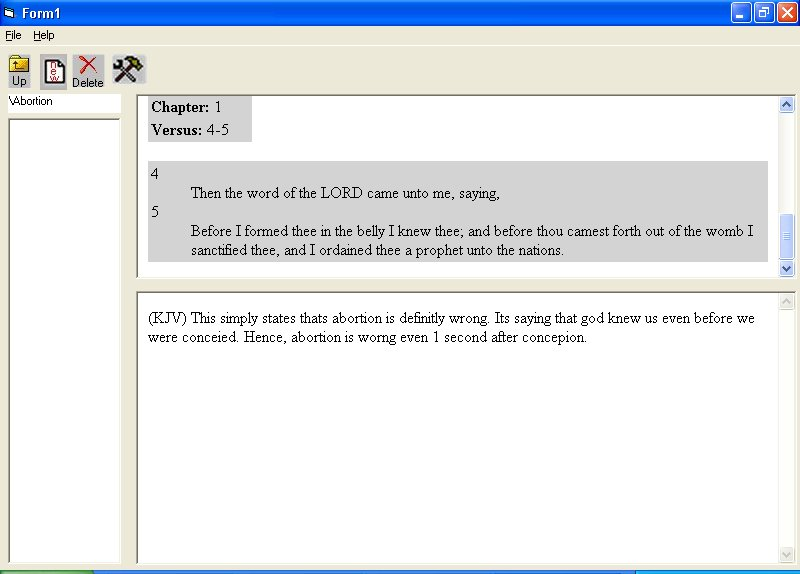



## Bible Concordance/ Topic Viewer

### Description

This is a Bible concordance that you can use to store bible related topics and scriptures. So like you could create a topic entiled "Abortion", with scriptures against it, and come back at a later time and view it. It uses an elaborate database of text files to store all info. Next version im going use MS Database. If you add anything cool to it, please let me know. Thanks.
 
### More Info
 

             |
---                |---
**Submitted On**   |2002-05-15 16:07:54
**By**             |[Basshound USA](https://github.com/Planet-Source-Code/PSCIndex/blob/master/ByAuthor/basshound-usa.md)
**Level**          |Intermediate
**User Rating**    |4.4 (31 globes from 7 users)
**Compatibility**  |VB 5\.0, VB 6\.0
**Category**       |[Databases/ Data Access/ DAO/ ADO](https://github.com/Planet-Source-Code/PSCIndex/blob/master/ByCategory/databases-data-access-dao-ado__1-6.md)
**World**          |[Visual Basic](https://github.com/Planet-Source-Code/PSCIndex/blob/master/ByWorld/visual-basic.md)
**Archive File**   |[Bible\_Conc837805162002\.zip](https://github.com/Planet-Source-Code/basshound-usa-bible-concordance-topic-viewer__1-34824/archive/master.zip)

